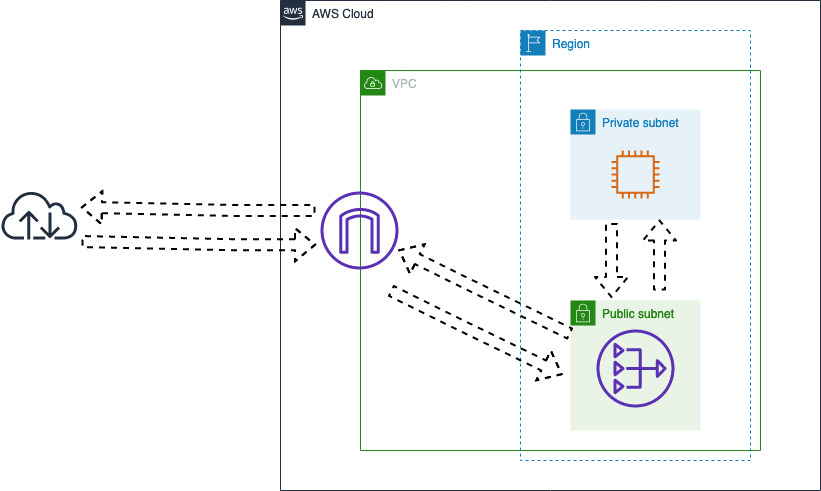

* [Amazon API Gateway](#Amazon-API-Gateway)
* [Amazon CloudFront](#Amazon-CloudFront)
* [AWS Direct Connect](#AWS-Direct-Connect)
* [AWS Global Accelerator](#AWS-Global-Accelerator)
* [Amazon Route 53](#AWS-Route-S3)
* [AWS Transit Gateway](#AWS-Transit-Gateway)
* [Amazon VPC (and associated features)](#amazon-vpc-and-associated-features) 

# Amazon VPC (and associated features)

# What is a VPC?

Virtual Private Cloud (VPC) is an isolated virtual network - for a given AWS Account in a Region - with the benefits of using the shared and scalable infrastructure of AWS, as a comparison, think about a private network as we would find in a Data Center.

Differently from its Data Center counterparts, VPCs abstract network´s physical infrastructure complexity and detach the network service from it. Which means that we barely know any physical details of the hardware used to provide the network service to us. The obvious benefit is that we don´t need to be expert on any network gear to be able to configure and launch a virtual network, it also means that we can count on AWS technical team to run all the required hardware and facilities for us.

As we consume VPC as a service, we can concentrate on our business needs and how to configure our network to support it. That also means that we don´t need to observe some of the elements of a traditional network, for instance, we don´t need to configure things like VLANs nor bother ourselves with Switches or even cabling.

That's sounds amazing, right? But why do we need a VPC to begin with?

You may be asking yourself that - which is an askable question - and the reason is quite simple: VPC is a foundational service, other AWS resources rely on it. Don't believe me? Try to launch an EC2 instance, it will ask you to define a VPC and a Subnet (which is a VPC's component), ECS does the same and go a step further to create a new VPC if needed.

There is no additional charge for using a VPC itself (there are charges for some VPC components though, such as NAT gateways, Reachability Analyzer, and Traffic mirroring).

VPC sounds really important, right? And it is, it is so important that for account created after 2013/12/04 a default VPC is automatically created, and it has a default subnet in each Availability Zone. 

* VPC's Components
    * [Virtual Private Cloud (the VPC itself)](#virtual-private-cloud-the-vpc-itself)
    * [Subnet](#subnet)
    * Networking Components
        * Internet Gateway
        * Egress-only Internet Gateway
        * DHCP Options Set
        * NAT
            * NAT Gateway
            * NAT Instances
    * Security
        * NACL
        * Security Groups
    * Route Table
    * Virtual private gateway
    * Peering Connection
    * PrivateLink
    * VPC Endpoints
    * Flow Logs

Let's get into VPC's Components details, shaw we?

* # Virtual Private Cloud (the VPC itself)
    * A logically isolated virtual network dedicated to a given AWS account in a given Region.
        * VPC are logically isolated, even from each other, if you want to have two or more VPN connected, you need to explicitly create that connection using a VPC Peering
            * If you need external connectivity, you need to explicitly create an Internet Gateway or Nat Gateway
        * When we create a VPC, we are "reserving" (or isolating) some networking block. This block must be polulated by other AWS resources
    * VPC Types
        * Default
            * After 2013/12/04,  Default VPC is automatically created for your AWS account, EC2 instances launched without specifying subnet ID will be launched in the default VPC
                * AWS automatically configure it for you, facilitating the beginning of your Cloud Journey
                    * What do you will find in your Default VPC configuration?   
                        * A /16 IPv4 CIDR block (172.31.0.0/16)
                        * /20 default subnet in each Availability Zone
                        * An Internet Gateway
                        * VPC's main route pointing to a Route Table configured with a 0.0.0.0/0 route to the Internet Gateway
                            * The main rote can be changed later, if needed. As this is the main route table, all of your default Subnet will be associated with it. More on that later on
                        * A Security Group named "Default" with a single All Traffic entry sourcing itself
                            * OK, this one deserves an explanation right here, right now :) - When we add a Security Group as source or destination of a rule, we are saying that this rules applies over all interfaces associated with that Security Group. We will cover that in more details later on but for now keep in mind that this "Default" Security Group will allow all local traffic between all instances associated with it
                        * Default NACL allowing all Income and all Outcome traffic
                            * Ok, another explanation is needed right here, right now :) - When a VPC is created, automatically we also have a default NACL created. This default NACL has an allow all rule created by default. All Subnet created without an association to a specific NACL will be associated with the default NACL. We will see more about this later on, but for now it is important to know that all of your default Subnet will also have all Income and Outcome traffic allowed
                        * A DHCP options set
            * Only one Default VPC is allowed per Region
            * You can delete your default VPC
                * It may have implication ig you have AWS resources associated with it
                * If you need a Default VPC back, you need to contact AWS support
        * NonDefault
            * Any other VCP created by an user using their accounts
                * Need to configured from scratch, allowing flexible design but requiring knowledge
    * VPC limits
        * You can have five VPCs per AWS account per region
    * CIDR 
        * Classless Inter-Domain Routing. It is a method to allocate and routing IP addresses.
        * You must specify an IPv4 address range as a CIDR block when you create your VPC, it will be the primary CIDR block for your VPC
            * When you associate a CIDR block with your VPC, a route is automatically added to your VPN route tables to enable routing within the VPC
            * Subnets created on a given VPC must have their IP address within VPC's CIDR block
        * VPCs can have an optional IPv6 CIDR block
            * It is require to assign IPv6 to Subnets and EC2 instances
    * A VPC spans all of the Availability Zones in the Region
    * Tenancy
        * When we create a VPC, we can pre-determine if we want instances launched on it to run on shared or dedicated hardware
            * Default
                * Instances will be launched on shared tenancy hardware unless the instance itself has a different tenancy specification
            * Dedicated
                * Enforces all instances launched on this VPC run on single-tenant hardware
        * Dedicated Instances have a different cost, it must be a consideration for Cost Optimization when this necessary
* # Subnet
    * VPCs "reserve" networking blocks but we need Subnets to partition this space into usable networking segments, therefore, we need to create our Subnets withing a VPC
        * We can apply sub-networking technics to create these segments
              * Effectively, we use subnets to specify a range of IP addresses in our VPC
        * AWS resources are launched into a specified subnet
    * You must specify a CIDR Block when you create a Subnet
        * Subnet's CIDR block can be the same of the VPC
            * We will have a single Subnet in that VPC
        * Subnet's CIDR can be a subset of VPC's CIDR
            * We can have multiple subnets in that VPC
    * Subnets will inherit main Route Table and main Network ACL from VPC
        * It can be changed, though
    * There are five reserved IP addresses in each subnet IPv4 CIDR (using a 10.0.0.0/24 CIDR block as an example):
        * 10.0.0.0
            * Network address
        * 10.0.0.1
            * Reserved by AWS for VPC router
        * 10.0.0.2
            * Reserved by AWS for Amazon DNS server
        * 10.0.0.3
            * Reserved by AWS for future use
        * 10.0.0.255
            * Network broadcast address (not supported in a VPC but reserved nevertheless)
    * Subnet types:
        * Public 
            * A Subnet that is associated with a Route Table that has a route to an Internet Gateway
                * Use a public subnet for internet facing resources
                    * Subnet traffic is routed to an Internet Gateway
        * Private
            * A Subnet that is associated with a Route Table that does not have a route to an Internet Gateway*
                * Use a private subnet for internal resources
        * VPN-Only
            * Use a VPN-only subnet for Site-to-Site
                * Subnet traffic is routed to a Virtual Private Gateway
    * You can add one or more subnet in each Availability Zone
        * Subnet can't span Availability Zones
            * Having instances launched in different Availability zone protect your workload from the failure of a single location
    * Subnets also can be added in a Local Zone
* # Networking Components
    * # Internet Gateway
        * When a VPC is created, it is isolated from the Internet, which means that AWS resources launched inside this VPC can't reach external Internet nor be reached by external sources. But it is an fair assumption that - at least - some of your resources must be exposed to the Internet, so that's when Internet Gateway come in handy. 
        * Internet Gateway serves two purposes
            * Provide a target for Internet-routable traffic
                * In our Route Table, we can create a route for 0.0.0.0/0 or ::/0 pointing to Internet Gateway
            * Perform NAT for instances assigned with a Public IPv4
                * EC2 Instances are only aware of the their private IPv4, Internet Gateway automatically performs one-to-one NAT between instance's private and public addresses
        * Only one Internet Gateway can be attached to a VPC at a time
        * To use an Internet Gateway, we must
            * Create an Internet Gateway
            * Attach it to a VPC
            * Add a route in our Route Table point to it
            * Ensure that our instances have a public IPv4 address, Elastic IP address, or IPv6 address
            * Ensure that our NACL and Security Groups are allowing traffic
    * # Egress-only Internet Gateway
        * Egress-only Internet Gateway is basically identical to Internet Gateway expect for:
            * It is exclusive for IPv6
                * As all IPv6 are public by default
            * Its main goal is to prevent Internet resources to initiate connection to your Instances running with IPv6
                * Egress-only Internet Gateway doest allow Internet resources to initiate sessions to instances running IPvv6 as it is Stateful, allowing only external resources' reply to reach instances
    * # DHCP Options Set
        * By Default all instances in a nonDefault VPC instances receives unresolvable names, we can assign our DNS servers to change that
        * The fallowing are the supported DHCP options we can set:
            * domain-name-servers
                * Up to four custom domain name server or AmazonProvidedDNS
                    * Don't mix both though 
            * domain-name
                * Custom domain nome (for instance "maycompany.com')
                    * if you are using a custom Domain Name Server, it must be able to resolve hostnames as appropriated
                    * If a Route 53 private hosted zone is in use, AmazonProvidedDNS can also be used
            * ntp-servers
                * up to four NTS server address
                * We can use Amazon Sync Service
                    * IPv4: 169.254.169.123
                    * IPv6: fd00:ec2::123 (only available on Nitro System)
            * netbios-name-servers
                * Custom netbios server name, None by default
            * netbios-node-type
                * netbios node type (1, 2, 4, or 8), None by default
    * # NAT
        * As mentioned before, we have private subnets and instances placed on these private subnets don't have exposure to the Internet. To allow these instances to initiate sessions to Internet resources we can use a NAT device. Network Address Translation (or NAT) is a technic that expose just one element to the Internet (in this case, a Nat device) and use this element Public IP to connect to an Internet destination requested by elements placed in privates parts of our network (in this case, our EC2 instances), take a look in the following diagram:
        
        As we can see, we have our EC2 inside a private subnet and our NAT Gateway is inside a public subnet, in this case, we just need to add a route redirecting all Internet-routable to that NAT Gateway. Of course we need to configure our Security Groups and NACL to allow that traffic, but for the sake of simplicity, let's assume that's also done properly.
        * # NAT Gateway
        * # NAT Instances
* # Security
    * As we would see in a regular data center's networking, we have security rules applied over our VPCWe have two major security implementations:
        * # NACL
            * Control inbound and outbound traffic for subnets
                * Each subnets must be associated with a network ACL
                    * Subnets are automatically associated with VPC's default network ACL
                        * This association can be changed
                        * VPC's default network ACL can be changed
        * # Security Groups
            * Resembles a STATEFUL firewall
            * Control inbound and outbound traffic for instances
* # Route table
    * A set of routes that are used to determine where network traffic is directed.
    * Each subnet must be associated with a route table
    * All user created subnet are automatically associated with VPC's main route table
        * This association can be changed
        * VPC's main route can be changed
* # VPC endpoint
    * Enable private connection between your VPC and supported AWS services without an Internet gateway.
* # Flow Logs
    * Can be create on VPCs, subnets or interfaces
        * Capture incoming and outgoing traffic

# More about VPC

## VPC and Subnet sizing For IPv4

We already covered a lot about VPC, let's start to investigate how it deals with IP addressing:

* Primary CIDR block
    * Defined when VCP is created
    * Can't be disassociated
    * IPv4 CIDR Block between /16 (65,536 IP addresses) and /28 (16 IP Addresses)
    * It is recommended to use RFC 1918's IPv4 address range to specify primary CIDR blocks
        * 10.0.0.0 - 10.255.255.255 (10/8 prefix)
        * 172.16.0.0 - 172.31.255.255 (172.16/12 prefix)
        * 192.168.0.0 - 192.168.255.255 (192.168/16 prefix)
* Secondary CIDR block 
    * Can be associated after VPC creation
    * Can be disassociated
    * IPv4 CIDR Block between /16 (65,536 IP addresses) and /28 (16 IP Addresses)
    * CIDR blocks must not overlap with any other existing CIDR in the same VPC
    * CIDR blocks can't be changed (increased or decreased)
    * There is a quote for CIDR blocks
    * The CIDR block must not be the same or larger than a destination CIDR ranger in a route in any of the VPC route tables
    * VPC enabled for ClassicLink can have CIDR blocks from the 10.0.0.0/16 and 10.1.0.0/16 ranges associated, but any other CIDR block from the 10.0.0.0/8 range can't be.
    * VPC peering rules (IPv4)
        * If the VPC peering connection is active
            * CIDR blocks can be added to a VPC (this block can't overlap with peer's VPN block)
        * If the VPC connection is pending-acceptance
            * The requester cannot add any CIDR block to the its VPC
                * We need to wait until the peering to be accept by the accepter before add a CIDR block, or
                * The requester can delete the peering request, it will allow a CIDR block to be added
            * The accepter can add CIDR blocks to its VPN
                * If this block overlaps with requester's VPC's CIDR block, the peering request will fail
    * When using AWS Direct Connect, the VPCs that are associated with the Direct Connect must not have overlapping CIDR blocks
    * CIDR block association states
        * associating
        * associated (ready to be used!!)
        * disassociating
        * disassociated
        * failing
        * failed

## VPC and Subnet sizing For IPv6

* A single IPv6 CIDR block can be associated with a VPC or Subnet
    * IPv6 CIDR block can be disassociated from a VPC or Subnet
* We request an IPv6 block from Amazon's pool
    * VPC's CIDR block has a fixed prefix length of /56
        * Subnet's CIDR block has a prefix length of /64
    * If disassociated, we lose that IPv6 CIDR block
        * A new IPv6 CIDR block will be associated with we decide to associate a CIDR block later on
    * There are five reserved IP addresses in each subnet IPv6 CIDR (using a 2001:db8:1234:1a00/64 CIDR block as an example):
        * 2001:db8:1234:1a00::
        * 2001:db8:1234:1a00::1
        * 2001:db8:1234:1a00::2
        * 2001:db8:1234:1a00::3
        * 2001:db8:1234:1a00:ffff:ffff:ffff:ffff

Amazon VPC Quotas
* There is a quote on the number of VPCs and subnets you can create in your account
    * VPC
        * 5 per region
        * Adjustable
            * Max of 100 VPCs per region
                * increasing VPC quote will affect Internet Gateway's quote by the same amount
    * Subnet
        * 200 per VPC
        * Adjustable
    * IPv4 CIDR
        * 5
        * Adjustable
            * Max of 50 IPv4 CIDR blocks
    * IPv6 CIDR
        * 1
        * Not adjustable

# VPC Management

We can create, access and manage VPC using any of the following interfaces:
* AWS Management Console
* Command Line Interface (CLI)
* AWS SDK
* Query API

References:
* https://docs.aws.amazon.com/vpc/latest/userguide/what-is-amazon-vpc.html
* https://docs.aws.amazon.com/vpc/latest/userguide/VPC_Subnets.html
* https://docs.aws.amazon.com/vpc/latest/userguide/vpc-nat.html